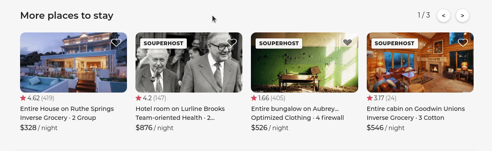

# SouperHost: More places to stay

> This react application is an image carousel. The client fetches data with express connecting it to mongoDB.

## Requirements

- Node >= 6.13.0
- MongoDB 4.4.1

## Getting Started

clone this repository
`$ git clone https://github.com/souperhost-3000/service-dannyhannyford.git`

Install dependencies
`npm install`

Seed database if necessary
`npm run seed`
> seeds your mongoDB with 100 listings

Build your webpack bundle
`npm run build`

Start your server
`npm start-local`
> starts the server on port:3007

## Related Projects

  - [Reviews](https://github.com/souperhost-3000/service-chris)
  - [Gallery](https://github.com/souperhost-3000/service-eric)
  - [Availability Calendar](https://github.com/souperhost-3000/service-day-glow)

## Table of Contents
1. [Requirements](#requirements)
